# Disclaimer - This is my project is unfinished

## Farm Management System

Farm Management System is a system designed to help farmers manage their farm workflow

## Description
* Main purpose of the application is to make it as easy to use as possible for farmers, so 
the app will be handy for them and easy to use for older people.
* Farmer usually make a lot of notes about things they do or use - with this application farmers can
make notes about the actions, tasks that must be performed. Farmers can just simply provide 
parameters to this app instead of providing it to their notebooks - you can easily forget the notebook but it is less likely
that you will forget you phone. Moreover when other users are
connected to the same Farm they can see each others work. 

## Aplikacja

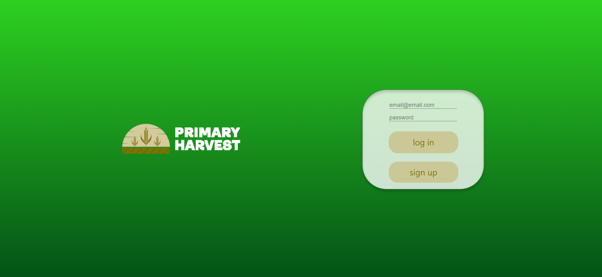

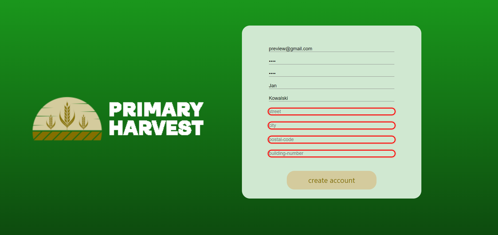

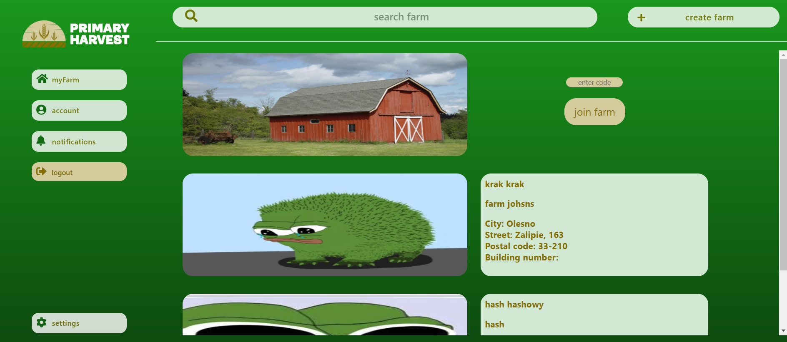

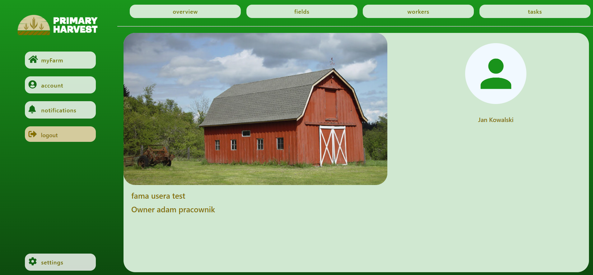

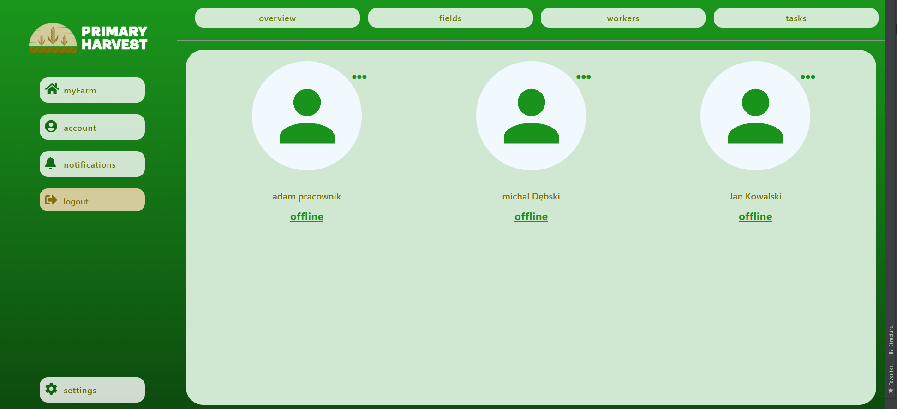

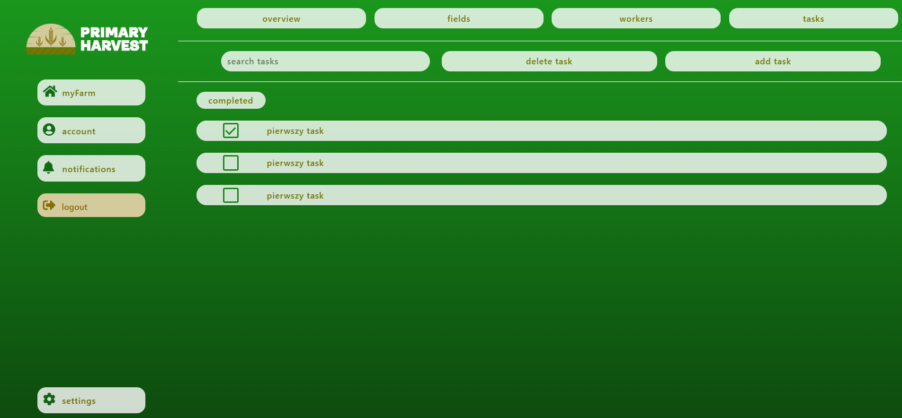
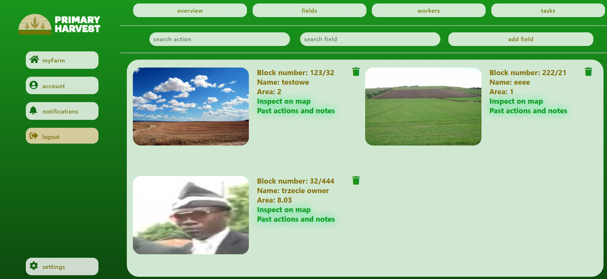
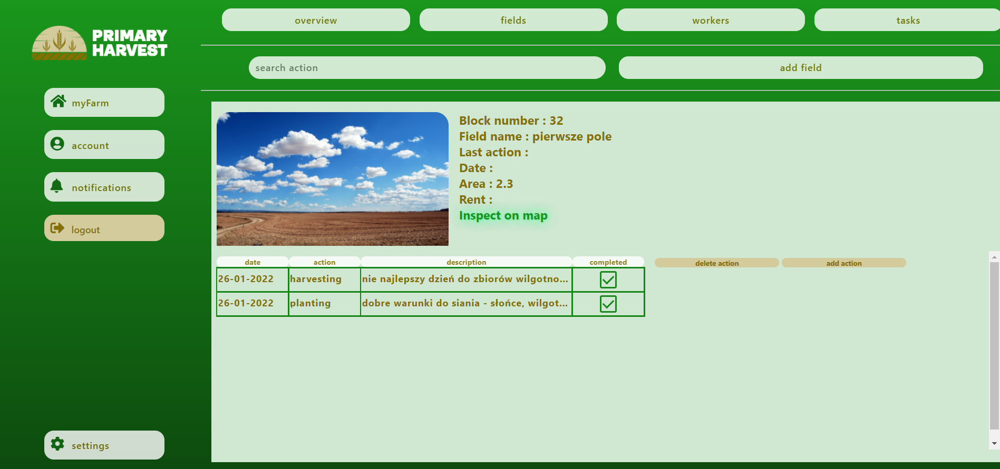

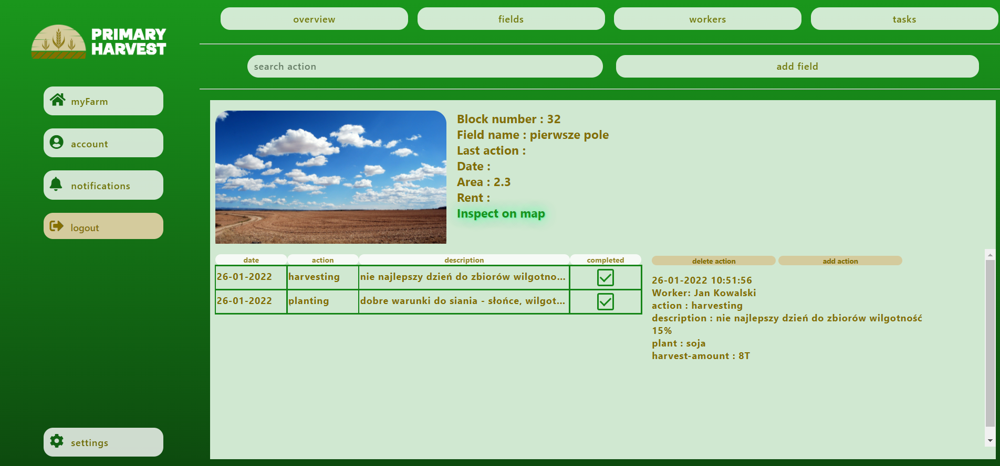

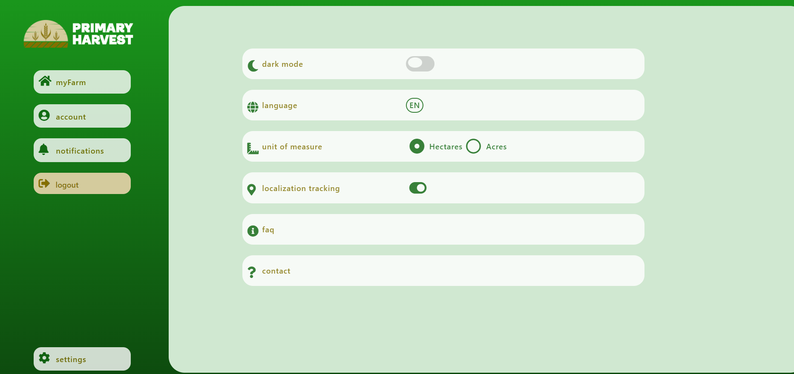

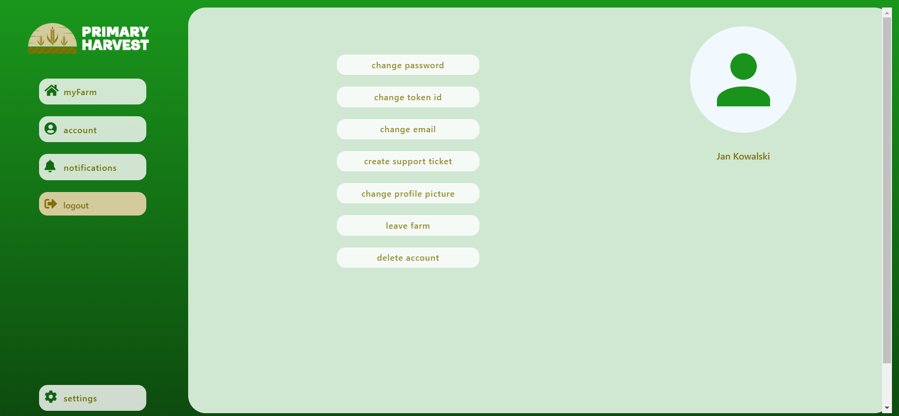

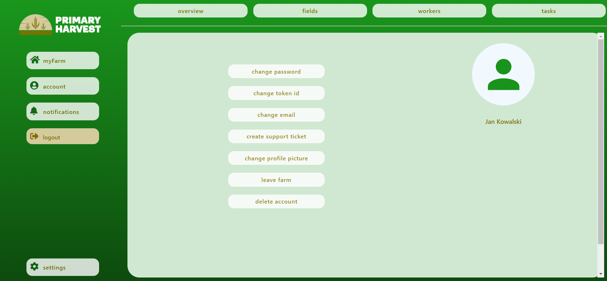

## Mobile app

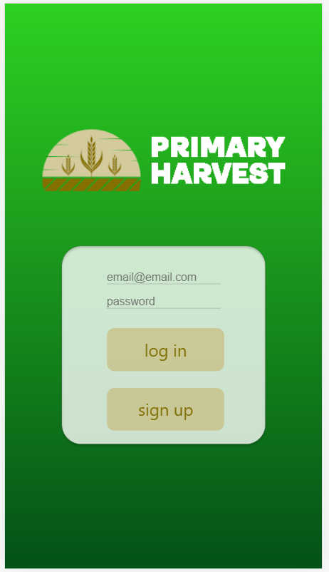

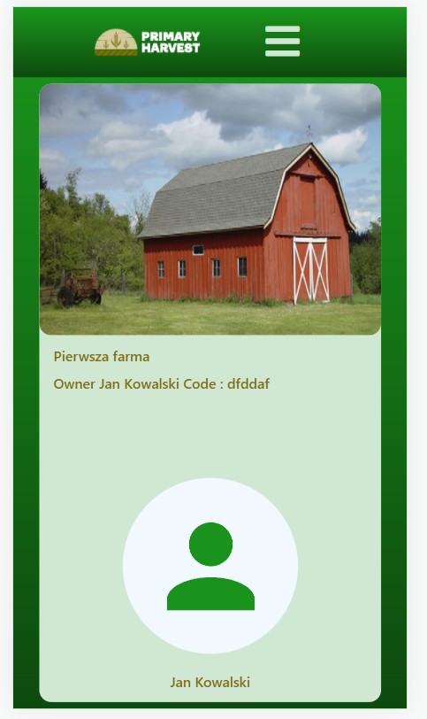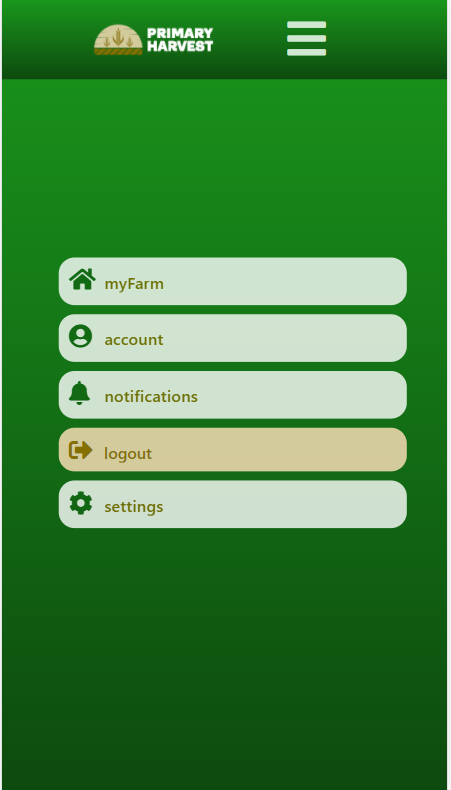

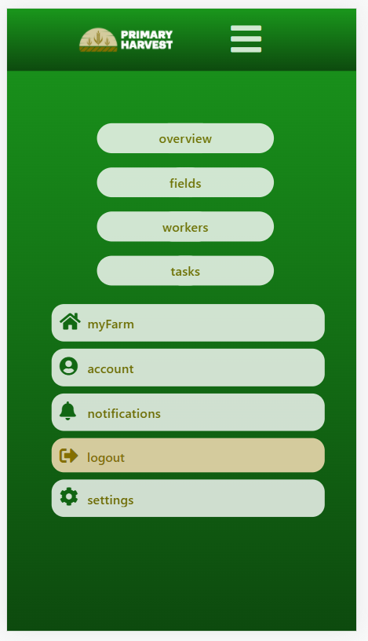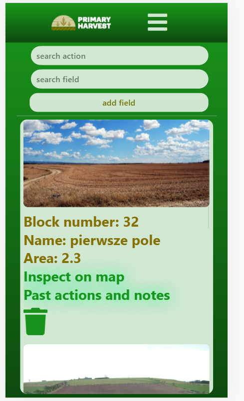
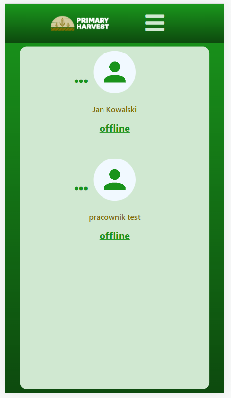

